# Introduction to FFUF for Web Application Testing


## Overview

FFUF (Fast Web Fuzzer) is a powerful tool written in Go that is widely used by penetration testers and security professionals. It plays a vital role in web application testing by helping identify hidden directories, subdomains, parameters, and endpoints. By leveraging FFUF, testers can uncover vulnerabilities, misconfigurations, and potentially sensitive information that might be inadvertently exposed.

### Why Use FFUF?

- **Efficiency**: FFUF is fast and highly configurable, allowing testers to handle large datasets with ease.
- **Discovery**: It enables the identification of hidden resources such as directories, files, and parameters that could lead to vulnerabilities.
- **Customization**: With features like customizable headers, POST data, and rate-limiting, FFUF can adapt to various testing scenarios.

### Example Use Case

“FFUF is a fast web fuzzer written in Go. It is widely used in penetration testing to identify vulnerabilities, hidden endpoints, and misconfigurations in web applications.”

## Prerequisites

Before diving into FFUF, ensure you have the following:

1. **Basic Knowledge**:
   - Understanding of HTTP protocols and web application behavior.
2. **Installed Tools**:
   - FFUF
   - Burp Suite (optional, for traffic analysis)
   - Test environment: Juice Shop (covered below)

## Installing Juice Shop on Linux

To test FFUF in a realistic environment, we will set up the OWASP Juice Shop, a deliberately insecure web application designed for training and testing purposes.

### Step 1: Update Your System

Make sure your system is up-to-date:

```bash
sudo apt update && sudo apt upgrade -y
```

### Step 2: Install Node.js and npm

Juice Shop requires Node.js and npm (Node Package Manager). Install them with:

```bash
sudo apt install -y nodejs npm
```

Verify the installation:

```bash
node -v
npm -v
```

### Step 3: Clone the Juice Shop Repository

Navigate to your desired directory and clone the Juice Shop repository:

```bash
git clone https://github.com/juice-shop/juice-shop.git
```

### Step 4: Install Dependencies

Navigate to the cloned Juice Shop directory:

```bash
cd juice-shop
```

Install the necessary dependencies:

```bash
npm install
```

### Step 5: Start the Juice Shop Server

Run the following command to start the Juice Shop server:

```bash
npm start
```
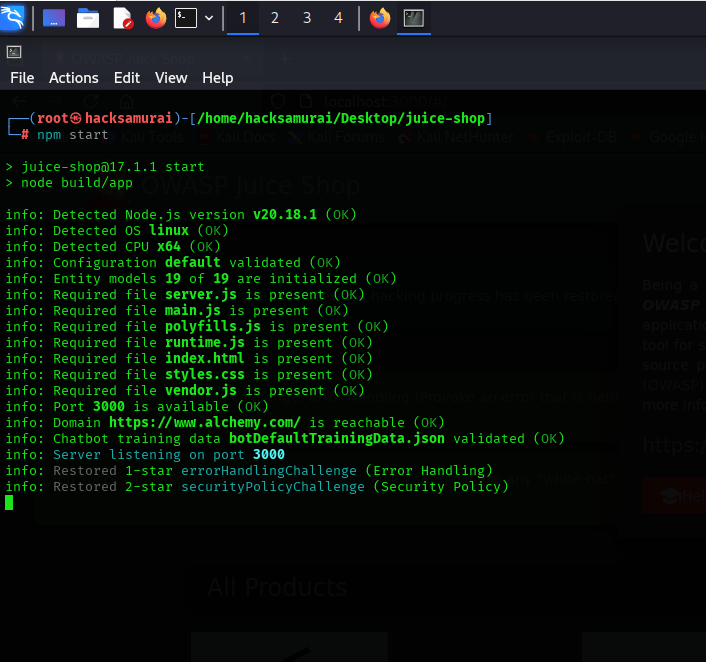

By default, the application will be accessible at `http://localhost:3000`.

### Step 6: Verify the Setup

Open your browser and navigate to:

```
http://localhost:3000
```

You should see the OWASP Juice Shop interface.

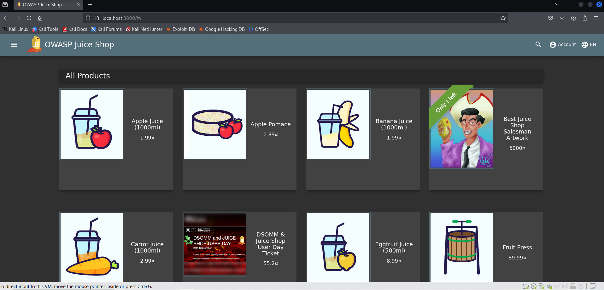

---

# Basic Fuzzing with FFUF

## Objective

Learn how to find hidden directories or files in a web application using FFUF.

## Steps

### Step 1: Set Up a Test Environment

Use an intentionally vulnerable web application such as OWASP Juice Shop, DVWA, or a Hack The Box (HTB) machine. For this example, we’ll use the OWASP Juice Shop running locally at:

```
http://localhost:3000/
```

### Step 2: Download and Set Up a Wordlist

To perform effective fuzzing, you need a comprehensive wordlist. One of the most popular resources is the SecLists repository. Follow these steps to download it:

1. Navigate to your desired directory and clone the SecLists repository:
   ```bash
   git clone https://github.com/danielmiessler/SecLists.git
   ```
2. Locate the directory wordlists for directories:
   ```bash
   cd SecLists/Discovery/Web-Content
   ```
   A commonly used wordlist is `common.txt`.
  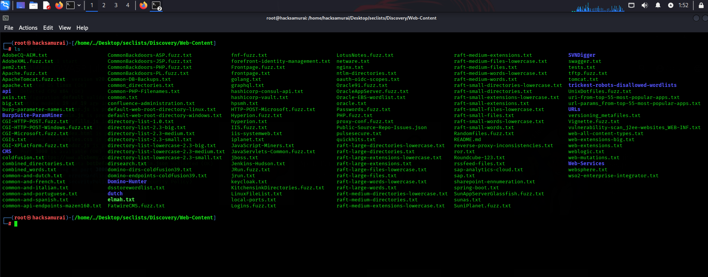

### Step 3: Fuzz for Directories
we will start by issuing the ffuf -h command to see how the tools can be used:
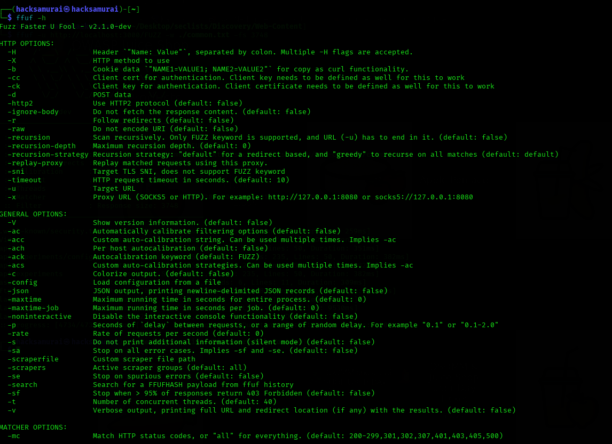


Run the following FFUF command to start fuzzing for hidden directories:

```bash
ffuf -u http://localhost:3000/FUZZ -w /path/to/SecLists/Discovery/Web-Content/common.txt
```
- Replace `FUZZ` with the placeholder used by FFUF for fuzzing.
- Use the `common.txt` wordlist from the SecLists repository.


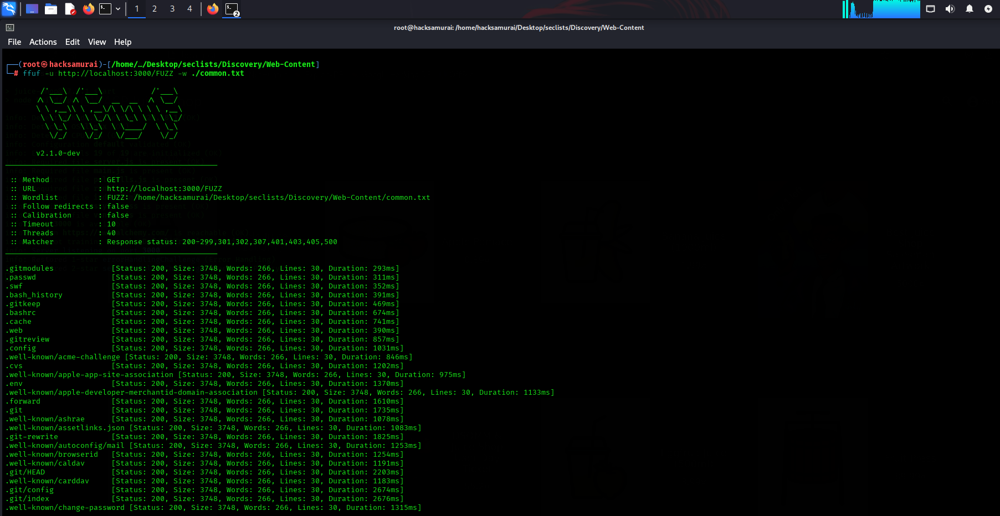
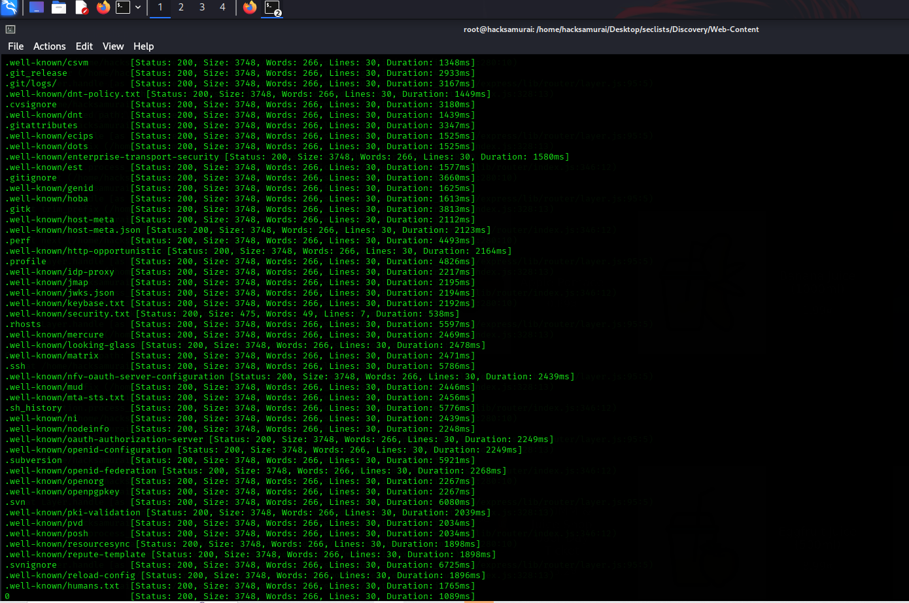
I we see running ffuf for directory fuzzing on http://localhost:3000/ using the common.txt wordlist. From the results, many files and directories are returning Status: 200 with a size of 3748 bytes.

 We know the response size of the incorrect results, which, as seen from the test above, is 3748, and we can filter it out with -fs 3748. Now, let's repeat the same previous command, add the above flag, and see what we get:
 ```bash
ffuf -u http://localhost:3000/FUZZ -w /path/to/SecLists/Discovery/Web-Content/common.txt -fs 3748
```

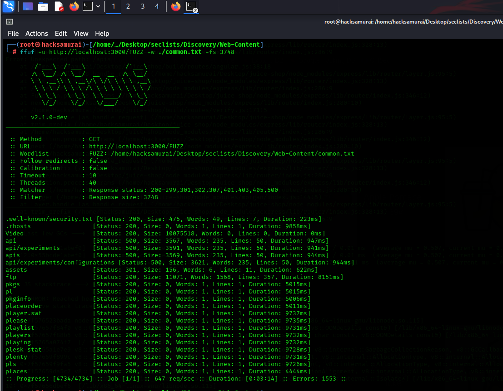

Note either the most common size, words or lines for the false positive responses and then specify them in a filter. Use:

-fw : to filter by the amount of words

-fl : to filter by the number of lines

-fs : to filter by the size of the response

-fc : to filter by the status code

-fr : to filter by the regex pattern

let's see one directory from the results and see what we find:
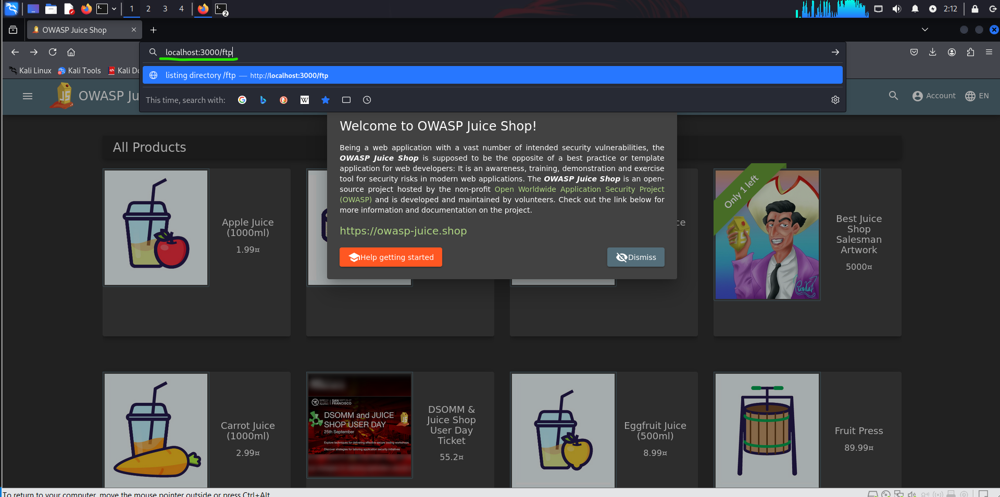
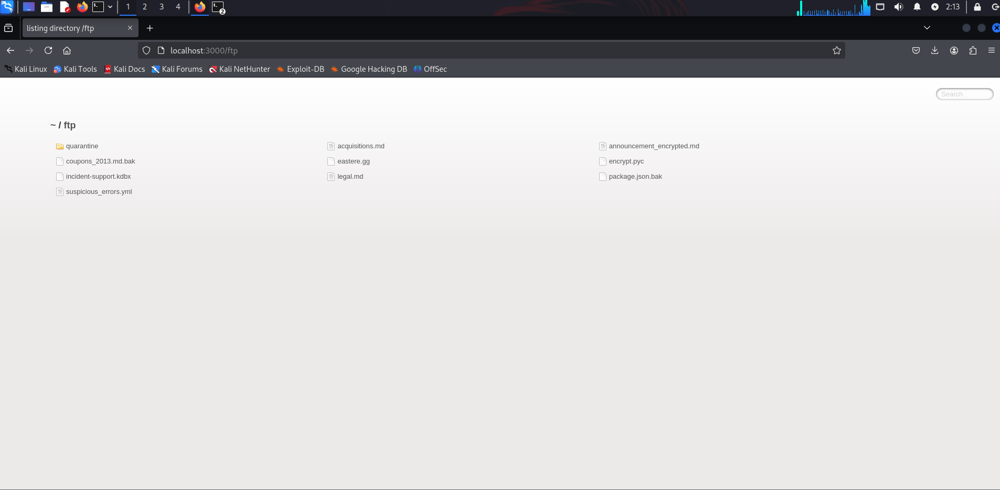

-As we see it work.

# Domain Fuzzing with FFUF

## Objective

Discover subdomains in a target domain using FFUF.

\*\*Sub-domain Fuzzing
\*\*

-A sub-domain is any website underlying another domain. For example, [https://photos.google.com](https://photos.google.com) is the photos sub-domain of google.com.


### Step 1: Set Up Your Target Domain

For this guide, we will be using inlanefreight.com

**Inlanefreight.com**:  is a domain often referenced in cybersecurity training exercises, such as Hack The Box challenges. It is used for web enumeration, ethical hacking practice, and CTF-style tasks, helping cybersecurity learners develop skills in information gathering and vulnerability assessment.


### Step 2: Download a Subdomain Wordlist


Navigate to the subdomains list directory:

```bash
cd SecLists/Discovery/DNS
```

A commonly used wordlist is `subdomains-top1million-5000.txt`.

### Step 3: Run FFUF for Domain Fuzzing

Use the following command:

```bash
ffuf -w  /path/to/seclists/Discovery/DNS/subdomains-top1million-5000.txt:FUZZ -u https://FUZZ.inlanefreight.com/
```
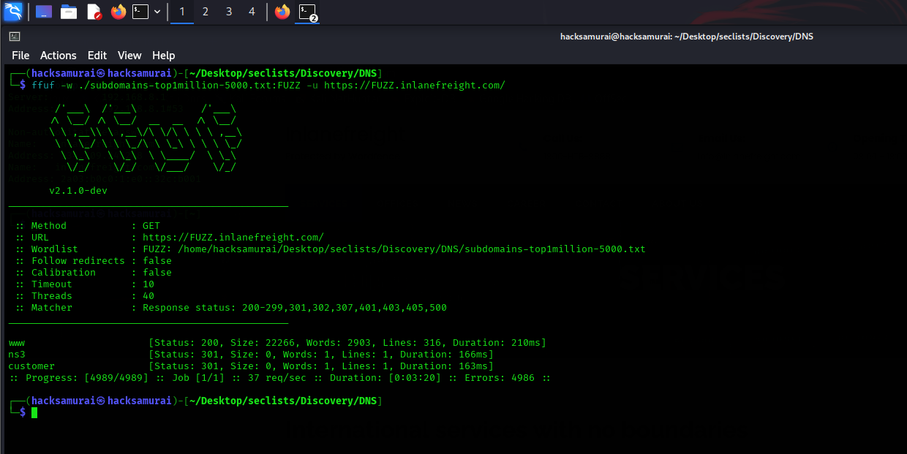

We see that we do get a few hits back.

### Step 4: Verify with Additional Tools:
let's verify the subdomain "customer" with a simple HTTP request:

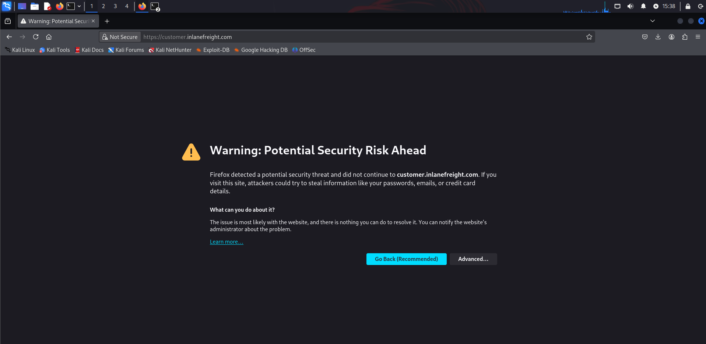
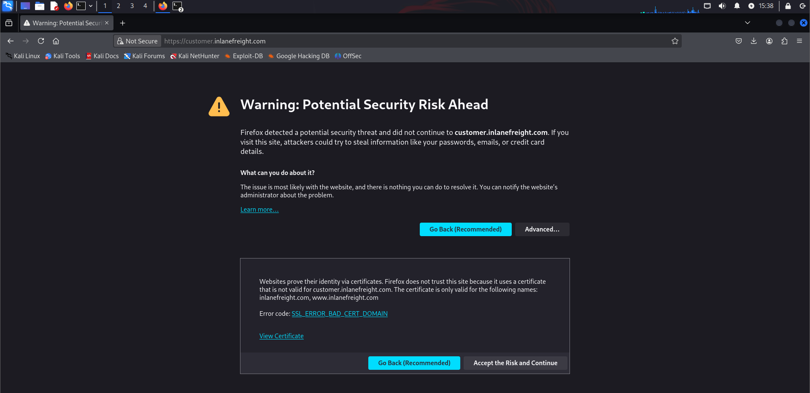

To confirm findings, use:

```bash
nslookup  customer.inlanefreight.com

```
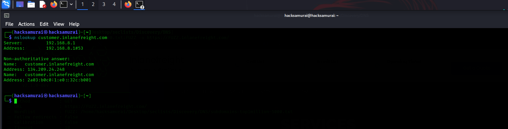

We have found that subdomain "customer"  is active and has a valid DNS entry. This could be a potential entry point for further enumeration and exploitation.


# Parameter Fuzzing (Identifying Hidden Parameters)

## Objective
Discover hidden or undocumented HTTP GET and POST parameters that could be exploited for vulnerabilities such as SQL Injection, XSS, IDOR, or debug modes.

### Why Parameter Fuzzing Matters?
Some web applications use parameters that are not exposed in forms or URLs but are processed by the backend. Attackers can manipulate these parameters to bypass authentication, retrieve sensitive data, or trigger unintended application behaviors.

## Steps

### Step 1: Identifying the Target for Fuzzing
Before running FFUF, you need a URL that accepts parameters.  (we will use the juice shop application for this example)

Example Target:
```
http://localhost:3000/#/search?q=test
```
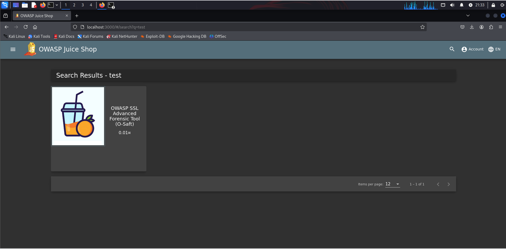

In this case, `q` is a visible GET parameter, but there might be hidden ones like `debug`, `admin`, or `id`.

You can also target POST requests:
```
http://localhost:3000/#/login
```
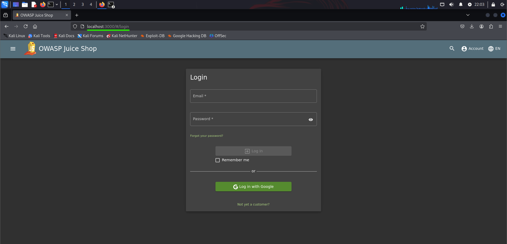
With potential parameters:
```json
{
  "username": "admin",
  "password": "password123",
  "FUZZ": "test"
}
```

### Step 2: Download and Set Up a Wordlist
To perform effective fuzzing, you need a comprehensive wordlist. One of the most popular resources is the SecLists repository. Follow these steps to download it:

   ```
  - Locate the directory for parameter fuzzing:
   ```bash
   cd SecLists/Discovery/Web-Content
   ```
   A commonly used wordlist is `burp-parameter-names.txt`.

### Step 3: Using FFUF for GET Parameter Fuzzing
Run the following FFUF command to start fuzzing for hidden GET parameters: (we will use the juice shop application for this example)
```bash
ffuf -u "http://localhost:3000/#/search?FUZZ=test" -w /path/to/SecLists/Discovery/Web-Content/burp-parameter-names.txt -mc 200 -fs 3748
```
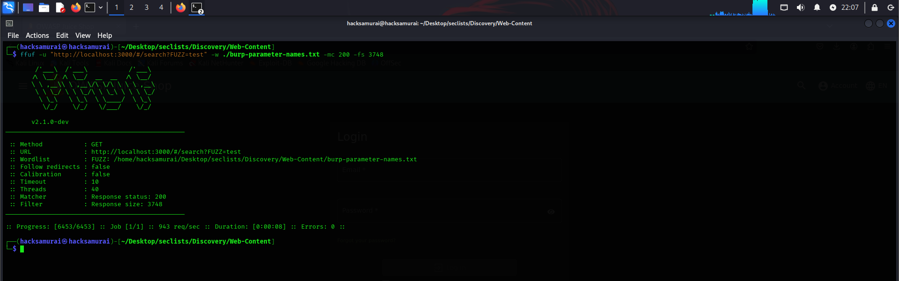

for me and i think for the juice Shop site the is no hidden Get parameters but you can test the Get Parameter Fuzzing on another Website.

### Step 4: Running FFUF for POST Parameter Fuzzing
Example request:
```http
POST /login HTTP/1.1
Host: localhost:3000
Content-Type: application/x-www-form-urlencoded
Content-Length: 32

username=admin&password=1234&FUZZ=test
```
FFUF Command for POST Parameter Fuzzing:
```bash
ffuf -u "http://localhost:3000/#/login" -X POST -d "username=admin&password=1234&FUZZ=test" -H "Content-Type: application/x-www-form-urlencoded" -w /path/to/SecLists/Discovery/Web-Content/burp-parameter-names.txt -mc 200 -fs 3748
```
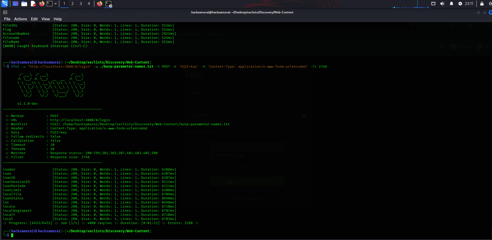


## Conclusion  

For more hands-on practice with FFUF, check out the **"Attacking Web Applications with FFUF"** module on **Hack The Box (HTB)**. This module provides real-world scenarios for fuzzing web applications and discovering hidden vulnerabilities.  

🔗 **HTB Academy Module:** [Attacking Web Applications with FFUF](https://academy.hackthebox.com/module/details/54)  


